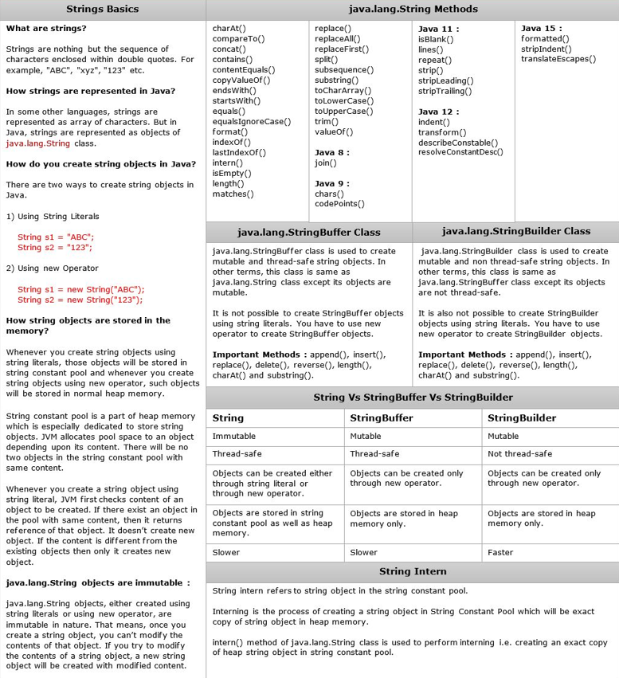

# 🚀 Java Fundamentals & Coding Interview Mastery


A comprehensive repository dedicated to **mastering Java programming fundamentals** and **acing coding interviews**, through structured exercises, book-based learning, and real-world problem-solving.

---

## 📝 About This Project

This project is designed to help you:

- **Become proficient in core Java concepts**, working through exercises from *Head First Java* by Kathy Sierra and Bert Bates.
- **Prepare for coding interviews** with 250+ Data Structures & Algorithms problems, including frequently asked LeetCode challenges.
- **Practice practical coding** with beginner to advanced problems and design patterns.

Whether you’re preparing for interviews or building foundational Java knowledge, this repository provides **practical, example-driven learning** to accelerate your progress.

---

## 📂 Directory Structure

```
Coding_Interview_250/
├── HeadFirstJava/
│   └── Chapter_1_/
│
├── src/
│   ├── annanomousTopics/
│   ├── Arrays/
│   ├── Arrays2/
│   ├── Arrays_and_ArrayList/
│   ├── ControlStatement/
│   ├── DatatTypesAndVariables/
│   ├── Day1_revision/
│   ├── Design_Pattern/
│   ├── ExceptionHandling/
│   ├── fileHandling/
│   ├── JavaWeek1/
│   ├── LeetCode_Easy/
│   ├── Loops/
│   ├── OOPs/
│   ├── operators/
│   ├── String2_topic/
│   ├── Strings3/
│   ├── Strings_topic/
│   └── Triangle_star_paattern/
│
├── out/
├── .idea/
├── Coding_Interview_250.iml
├── ReadMe.md
└── simple.txt
```


---

## 📚 250+ Coding Interview Questions (DSA) - Java

Welcome to the **250+ Coding Interview Questions (DSA) - Java** section! 🚀  
This collection covers **essential topics in Data Structures, Algorithms, Java concepts, and Design Patterns**, helping you prepare effectively for technical interviews.

---

## 📊 Topics Covered

| **Category**                 | **Topics** |
|------------------------------|------------|
| **Master Coding Questions**  | How to Take Input, Table Print, FizzBuzz, Palindrome Check, Grade Calculator, Leap Year Checker, Triangle Classifiers, Pyramid Patterns, Count Vowels, Prime Number Checker |
| **String Manipulations**     | Palindrome of String, String Reverse, Duplicate String, Java Anagrams, Valid Email Regex, Remove Whitespaces, Check Palindrome, Reverse String, Remove Leading Zeros, First Letter of Each Word, Longest Substring Without Repeating Characters |
| **Hashing Concepts**         | HashMap, HashTable |
| **Array Manipulations**      | Find Frequency, Duplicate Elements, Print Largest & Smallest Elements, Sum of Elements, Ascending Order Sort, Find Second Largest & Smallest, Odd & Even Numbers |
| **Design Patterns**          | Singleton Pattern, Factory Pattern, Decorator Pattern |
| **LeetCode 15 Easy Problems**| Two Sum, Reverse Integer, Palindrome Number, Roman to Integer, Longest Common Prefix, Valid Parentheses, Merge Two Sorted Lists, Remove Duplicates, Implement strStr(), Count and Say, Maximum Subarray, Climbing Stairs, Plus One, Add Binary, Sqrt(x) |

---

## 🚀📜 Java Cheat Sheet



---

## 🔥 Why This Repository?

- 📂 **Well-organized coding problems**
- ✅ **Beginner-friendly explanations**
- 🏆 **Covers frequently asked questions in FAANG interviews**
- 🛠️ **Practical implementation in Java**
- 📘 **Structured learning from Head First Java**

---

## ⚙️ Setup Instructions

> This repository is for **local Java development and study**.  
> No special dependencies required beyond the Java SDK and your preferred IDE.

1. **Clone the repository:**
   ```bash
   git clone https://github.com/Ritwik-vinay/Coding_Interview_250.git
Open in IntelliJ IDEA or any Java IDE of your choice.

Run Java files:

Navigate to any .java file inside src or HeadFirstJava.

Right-click and select Run, or compile manually:
javac YourClass.java
java YourClass
🧭 How to Navigate This Repository
HeadFirstJava/
Contains chapter-based solutions to exercises and review questions from Head First Java.

Learning Objectives:

Grasp foundational Java concepts step by step.

Reinforce knowledge through book-driven practice.

src/
Organized by topic to help you focus on specific skills:

Arrays & Collections

Control Statements

OOP

Exception Handling

Design Patterns

File Handling

Strings

LeetCode-style problems

Pattern printing

📚 References
Head First Java by Kathy Sierra and Bert Bates (O'Reilly Media)

🤝 Contributing
Contributions are welcome!

Fork the repository.

Create a new branch (feature/your-feature-name).

Commit your changes.

Push to your fork.

Open a Pull Request describing your updates.

